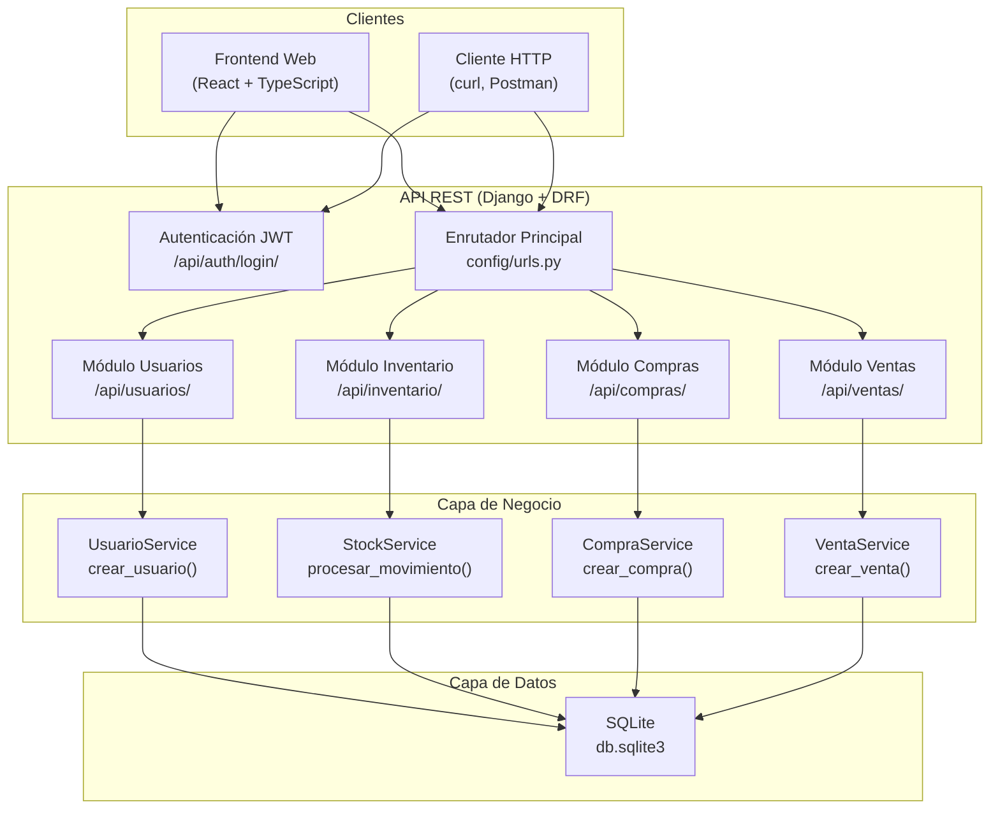
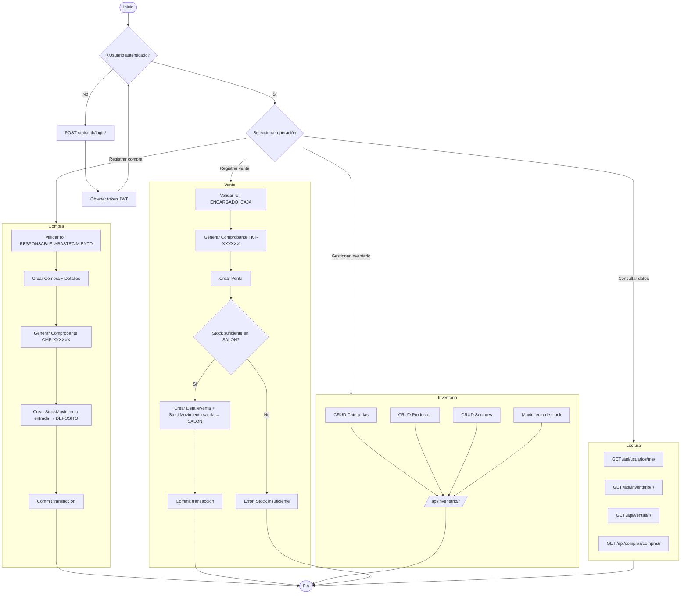

# Documentación del Sistema LogiRaf

## 1. Definiciones y especificación de requerimientos

### Definición general del proyecto

**LogiRaf** es un sistema de gestión logística y de inventario diseñado para comercios minoristas que necesitan controlar el flujo de mercadería desde la recepción en depósito hasta la venta en salón. El sistema proporciona una API REST que permite administrar usuarios con roles específicos, registrar compras de abastecimiento, controlar stock por sectores físicos (depósito y salón de ventas), registrar ventas con generación automática de comprobantes y mantener una trazabilidad completa de todos los movimientos de inventario.

Los propósitos fundamentales del sistema son:

- Centralizar la información de inventario en una única plataforma accesible desde cualquier dispositivo.
- Establecer un control de acceso basado en roles que restrinja las operaciones según el perfil del usuario.
- Automatizar la actualización de stock al registrar compras y ventas, eliminando la intervención manual y reduciendo errores.
- Proveer una trazabilidad completa de los movimientos de mercadería mediante un registro de auditoría.

### Usuarios

El sistema está orientado a empleados de un comercio minorista con distintos niveles de responsabilidad. Se definen los siguientes perfiles de usuario:

| Perfil | Descripción | Nivel técnico esperado |
|---|---|---|
| Administrador del sistema | Gestiona usuarios, roles y configuración general | Básico / Medio |
| Responsable de abastecimiento | Realiza compras y gestiona el ingreso de mercadería al depósito | Básico |
| Operador de depósito | Maneja el stock dentro del depósito y realiza movimientos internos | Básico |
| Encargado de depósito | Supervisa el depósito y aprueba movimientos de stock | Básico |
| Encargado de caja | Registra ventas y genera comprobantes | Básico |
| Encargado de salón | Gestiona el stock en el salón de ventas | Básico |
| Repositor | Repone mercadería del depósito al salón | Básico |

No se requiere experiencia técnica avanzada; la interacción se realiza a través de un frontend que consume la API REST o directamente mediante llamadas HTTP.

### Especificación de requerimientos

#### Requerimientos funcionales

- **RF-01:** El sistema debe permitir la creación y gestión de usuarios con contraseñas hash.
- **RF-02:** El sistema debe autenticar usuarios mediante tokens JWT.
- **RF-03:** El sistema debe autorizar operaciones según el rol del usuario autenticado.
- **RF-04:** El sistema debe permitir crear, leer, actualizar y eliminar productos.
- **RF-05:** El sistema debe permitir categorizar productos.
- **RF-06:** El sistema debe gestionar dos sectores físicos: depósito y salón de ventas.
- **RF-07:** El sistema debe mantener un registro de stock por producto y sector.
- **RF-08:** El sistema debe registrar cada movimiento de stock (entrada, salida, transferencia) con fecha y sectores involucrados.
- **RF-09:** El sistema debe validar que no se puedan realizar salidas de stock si la cantidad disponible es insuficiente.
- **RF-10:** El sistema debe permitir registrar compras de abastecimiento con múltiples productos.
- **RF-11:** Al registrar una compra, el sistema debe generar automáticamente un comprobante único y actualizar el stock del depósito.
- **RF-12:** El sistema debe permitir registrar ventas con múltiples productos.
- **RF-13:** Al registrar una venta, el sistema debe generar automáticamente un comprobante único y descontar el stock del salón.
- **RF-14:** Las operaciones de compra y venta deben ser atómicas (transaccionales).

#### Alcance

El sistema cubre la gestión completa del ciclo de inventario: compra → ingreso a depósito → transferencia a salón → venta. Incluye autenticación, autorización por roles, CRUD de entidades principales y generación de comprobantes.

#### Limitaciones

- El sistema no incluye un módulo de reportes o estadísticas operativo (la app `reportes` está definida pero deshabilitada).
- No implementa pasarela de pagos ni integración con sistemas contables externos.
- La base de datos utilizada en desarrollo es SQLite; no está optimizada para alta concurrencia en producción.
- No hay límite de stock máximo configurable; solo se valida stock mínimo para salidas.
- Los precios se toman del producto al momento de la venta; no hay gestión de precios históricos ni descuentos.

### Información de autoría y Legacy

El proyecto **LogiRaf** es un desarrollo original creado específicamente para la gestión logística de un comercio minorista. No deriva de ningún sistema preexistente ni implementa retrocompatibilidad con versiones anteriores. El repositorio se encuentra en `https://github.com/sebapalavecino2003/LogiRaf`.

**Autores:** Sebastián Palavecino (seba1junio@gmail.com)

### Procedimientos de desarrollo e instalación

#### Herramientas utilizadas

| Herramienta | Versión | Propósito |
|---|---|---|
| Python | 3.12.3 | Lenguaje de programación del backend |
| Django | 6.0.4 | Framework web |
| Django REST Framework | 3.17.1 | Construcción de la API REST |
| SQLite | — | Motor de base de datos |
| SimpleJWT | 5.5.1 | Autenticación por tokens JWT |
| django-cors-headers | 4.9.0 | Manejo de CORS |
| django-filter | 25.2 | Filtrado de resultados en la API |
| Visual Studio Code | — | Entorno de desarrollo |

#### Planificación

El desarrollo se organizó siguiendo una estrategia incremental basada en módulos funcionales:

1. Configuración del proyecto Django y definición del modelo de datos.
2. Implementación del módulo de usuarios con autenticación JWT y permisos por roles.
3. Implementación del módulo de inventario con productos, categorías, sectores y gestión de stock.
4. Implementación del módulo de compras con generación de comprobantes y actualización atómica de stock.
5. Implementación del módulo de ventas con descuento de stock y generación de comprobantes.
6. Pruebas de integración y validación de flujos completos.

#### Requisitos no funcionales

- **Seguridad:** Las contraseñas se almacenan con hash (PBKDF2/SHA256 por defecto en Django). La autenticación se realiza mediante tokens JWT con expiración.
- **Atomicidad:** Las operaciones de compra y venta se ejecutan dentro de transacciones de base de datos para garantizar consistencia.
- **Disponibilidad:** El sistema funciona como API REST stateless, permitiendo escalado horizontal del backend.
- **Portabilidad:** El backend se ejecuta en cualquier sistema que soporte Python 3.12 y las dependencias listadas.

#### Obtención e instalación

**Requisitos previos:**
- Python 3.12 o superior instalado.
- `pip` (gestor de paquetes de Python).
- `git` para clonar el repositorio (opcional).

**Pasos:**

```bash
# 1. Clonar el repositorio
git clone https://github.com/sebapalavecino2003/LogiRaf.git
cd LogiRaf

# 2. Crear y activar un entorno virtual
python -m venv venv
source venv/bin/activate  # En Linux/Mac
# venv\Scripts\activate   # En Windows

# 3. Instalar dependencias
pip install -r backend/requirements.txt

# 4. Ejecutar migraciones de base de datos
cd backend
python manage.py migrate

# 5. (Opcional) Crear un superusuario administrador
python manage.py create_admin --username admin --email admin@email.com --password mi_contraseña

# 6. Iniciar el servidor de desarrollo
python manage.py runserver
```

El servidor estará disponible en `http://localhost:8000`.

#### Especificaciones de prueba y ejecución

| Aspecto | Detalle |
|---|---|
| Entorno de ejecución | Local (servidor de desarrollo de Django) |
| Puerto predeterminado | 8000 |
| Base de datos | SQLite (archivo `backend/db.sqlite3`) |
| Modo DEBUG | Activado (desarrollo) |
| Autenticación | JWT (Endpoint: `/api/auth/login/`) |
| Cliente recomendado | curl, Postman, o cualquier navegador web |

Para verificar que el sistema funciona correctamente:

```bash
# Obtener token JWT
curl -X POST http://localhost:8000/api/auth/login/ \
  -H "Content-Type: application/json" \
  -d '{"username": "admin", "password": "mi_contraseña"}'

# Consultar usuario autenticado
curl http://localhost:8000/api/usuarios/me/ \
  -H "Authorization: Bearer <token>"
```

---

## 2. Arquitectura del sistema

### Descripción jerárquica

LogiRaf sigue una arquitectura monolítica modular basada en el patrón MTV (Model-Template-View) de Django, adaptado al estilo API REST con Django REST Framework. El proyecto se organiza en una aplicación de configuración principal (`config`) y cuatro aplicaciones Django independientes, cada una responsable de un dominio funcional específico:

```
LogiRaf/
└── backend/                        # Raíz del backend Django
    ├── config/                     # Configuración general del proyecto
    │   ├── settings.py             # Configuración (apps, DB, auth, CORS, JWT)
    │   ├── urls.py                 # Enrutador principal de la API
    │   ├── wsgi.py                 # Punto de entrada WSGI
    │   └── asgi.py                 # Punto de entrada ASGI
    ├── usuarios/                   # Módulo de usuarios y roles
    ├── inventario/                 # Módulo de inventario y stock
    ├── compras/                    # Módulo de compras y abastecimiento
    └── ventas/                     # Módulo de ventas
```

Cada aplicación sigue una estructura interna homogénea:

- `models.py` — Definición de entidades y relaciones.
- `views.py` — ViewSets de DRF que exponen los endpoints.
- `serializers.py` — Serializadores que transforman datos entre la API y el modelo.
- `services.py` — Lógica de negocio encapsulada (patrón Service Layer).
- `urls.py` — Enrutamiento interno de la aplicación.
- `permisos.py` — Clases de permisos personalizados (solo en `usuarios/`).
- `admin.py` — Configuración del panel de administración de Django.

### Diagrama de módulos (Espacio reservado)



### Descripción individual de los módulos

#### Módulo `config` (Configuración del proyecto)

- **Descripción:** Contiene la configuración global del proyecto Django: aplicaciones instaladas, middleware, base de datos, autenticación, CORS y enrutamiento raíz.
- **Responsabilidad:** Orquestar la carga del proyecto, definir la configuración de seguridad y distribuir las peticiones entrantes a las aplicaciones correspondientes.
- **Restricciones:** No implementa lógica de negocio. Es el punto de entrada único del servidor.
- **Dependencias:** Django, DRF, SimpleJWT, django-cors-headers, django-filter.
- **Implementación:** `backend/config/settings.py`, `backend/config/urls.py`, `backend/config/wsgi.py`, `backend/config/asgi.py`.

#### Módulo `usuarios` (Usuarios y Roles)

- **Descripción:** Gestiona la autenticación, los roles y el registro de usuarios del sistema.
- **Responsabilidad:** Proveer CRUD de usuarios y roles, autenticar mediante JWT y definir los permisos personalizados basados en roles que consumen los demás módulos.
- **Restricciones:** No puede crear usuarios sin contraseña ni username. El rol `ADMINISTRADOR_SISTEMA` se asigna automáticamente al superusuario.
- **Dependencias:** Django REST Framework, SimpleJWT.
- **Implementación:** `backend/usuarios/`.

#### Módulo `inventario` (Inventario y Stock)

- **Descripción:** Gestiona productos, categorías, sectores físicos y el control de stock con trazabilidad de movimientos.
- **Responsabilidad:** Mantener el catálogo de productos, registrar la cantidad disponible por sector y procesar movimientos de entrada, salida y transferencia validando stock suficiente.
- **Restricciones:** No puede realizar salidas de stock si la cantidad disponible es insuficiente. El movimiento de tipo `entrada` requiere un sector destino; `salida` requiere un sector origen; `transferencia` requiere ambos.
- **Dependencias:** Django REST Framework. Los servicios son consumidos por `compras` y `ventas`.
- **Implementación:** `backend/inventario/`.

#### Módulo `compras` (Compras y Abastecimiento)

- **Descripción:** Gestiona las compras de mercadería realizadas por el responsable de abastecimiento.
- **Responsabilidad:** Registrar compras con múltiples productos, generar comprobantes únicos con formato `CMP-XXXXXX` y actualizar automáticamente el stock del depósito mediante movimientos de entrada.
- **Restricciones:** Solo los usuarios con rol `RESPONSABLE_ABASTECIMIENTO` pueden acceder a este módulo. La operación es transaccional: si falla algún paso, se revierte toda la compra.
- **Dependencias:** `inventario` (modelos Sector, StockMovimiento; servicio StockService).
- **Implementación:** `backend/compras/`.

#### Módulo `ventas` (Ventas)

- **Descripción:** Gestiona las ventas realizadas en el salón o caja del comercio.
- **Responsabilidad:** Registrar ventas con múltiples productos, generar comprobantes únicos con formato `TKT-XXXXXX` y descontar automáticamente el stock del salón mediante movimientos de salida.
- **Restricciones:** La lectura de ventas es pública; la escritura requiere rol `ENCARGADO_CAJA` o personal staff. La operación es transaccional.
- **Dependencias:** `inventario` (modelos Sector, StockMovimiento).
- **Implementación:** `backend/ventas/`.

### Dependencias externas y aspectos técnicos

| Librería | Versión | Propósito | Justificación de diseño |
|---|---|---|---|
| Django | 6.0.4 | Framework web completo | Madurez, seguridad integrada, ORM robusto y comunidad extensa. Elegido sobre Flask por incluir ORM, administración y autenticación listos para usar. |
| Django REST Framework | 3.17.1 | Construcción de APIs REST | Es el estándar de facto para APIs REST con Django. Provee ViewSets, Serializers y autenticación integrada. |
| SimpleJWT | 5.5.1 | Autenticación JWT | Ligero, bien integrado con DRF, soporta refresh tokens y es configurable mediante settings de Django. |
| django-cors-headers | 4.9.0 | Cabeceras CORS | Necesario para permitir peticiones desde un frontend en un origen diferente (desarrollo local). |
| django-filter | 25.2 | Filtrado de querysets | Permite filtrar resultados de la API mediante parámetros URL sin escribir lógica adicional. |
| SQLite | — | Motor de base de datos | No requiere instalación ni configuración de servidor. Ideal para desarrollo y prototipado rápido. Migrable a PostgreSQL en producción sin cambios en el código. |

---

## 3. Diseño del modelo de datos

### Modelo de datos agnóstico

El sistema maneja ocho entidades principales que representan el dominio logístico:

**Rol** — Representa un perfil de usuario con permisos específicos dentro del sistema. Cada rol tiene un nombre único definido entre siete opciones fijas.

**Usuario** — Representa una persona que opera el sistema. Extiende la entidad de usuario de Django y agrega una referencia obligatoria a un rol. Se autentica mediante username y contraseña.

**Categoria** — Agrupación lógica de productos (ej: "Limpieza", "Almacén", "Bebidas"). No tiene jerarquía ni subcategorías.

**Producto** — Artículo comercializado. Posee nombre, marca, talle (opcional), descripción (opcional), precio unitario y pertenece a una categoría.

**Sector** — Ubicación física del inventario. Solo existen dos valores: `DEPOSITO` (almacén principal) y `SALON` (salón de ventas). Es una entidad única por tipo.

**StockPorSector** — Relación许多a muchos entre Producto y Sector que cuantifica el stock disponible. La combinación producto + sector es única.

**StockMovimiento** — Registro de auditoría que documenta cada cambio en el inventario. Almacena el tipo de movimiento (entrada, salida, transferencia), los sectores involucrados, la cantidad y la fecha.

**Compra** — Orden de abastecimiento realizada por el responsable correspondiente. Contiene la fecha, el total y el usuario responsable.

**DetalleCompra** — Línea individual dentro de una compra que asocia un producto, cantidad y precio unitario.

**ComprobanteCompra** — Comprobante fiscal asociado uno a uno con una compra. Su número se genera automáticamente con formato `CMP-XXXXXX`.

**Comprobante** — Comprobante de venta. Su número se genera automáticamente con formato `TKT-XXXXXX`.

**Venta** — Transacción de venta que vincula un comprobante y un vendedor.

**DetalleVenta** — Línea individual dentro de una venta que asocia un producto, cantidad y precio unitario de venta.

### Diagrama del modelo (Espacio reservado)

```mermaid
erDiagram
    Rol {
        int id_rol PK
        string nombre_rol UK
    }

    Usuario {
        int id_usuario PK
        string username UK
        string password
        string nombre_completo
        string first_name
        string last_name
        string email
        boolean is_staff
        boolean is_active
        date date_joined
        int rol_id FK
    }

    Categoria {
        int id_categoria PK
        string nombre_categoria
    }

    Producto {
        int id_producto PK
        string nombre_producto
        string marca
        string talle
        text descripcion_producto
        decimal precio_unitario
        int categoria_id FK
    }

    Sector {
        int id PK
        string tipo UK
        text descripcion
    }

    StockPorSector {
        int id PK
        int producto_id FK
        int sector_id FK
        int cantidad
    }

    StockMovimiento {
        int id PK
        int producto_id FK
        string tipo
        int sector_origen_id FK
        int sector_destino_id FK
        int cantidad
        datetime fecha
    }

    Compra {
        int id_compra PK
        datetime fecha_compra
        decimal total_compra
        int responsable_abastecimiento_id FK
    }

    DetalleCompra {
        int id PK
        int compra_id FK
        int producto_id FK
        int cantidad
        decimal precio_unitario
    }

    ComprobanteCompra {
        int id PK
        int compra_id FK UK
        string numero_comprobante UK
        datetime fecha_emision
    }

    Comprobante {
        int id_comprobante PK
        string numero_comprobante UK
        datetime fecha_emision
    }

    Venta {
        int id_venta PK
        datetime fecha_venta
        int comprobante_id FK UK
        int vendedor_id FK
    }

    DetalleVenta {
        int id_detalle PK
        int venta_id FK
        int producto_id FK
        int cantidad
        decimal precio_unitario_venta
    }

    Rol ||--o{ Usuario : "tiene"
    Categoria ||--o{ Producto : "clasifica"
    Producto ||--o{ StockPorSector : "tiene stock en"
    Sector ||--o{ StockPorSector : "contiene"
    Producto ||--o{ StockMovimiento : "registra movimiento"
    Sector ||--o{ StockMovimiento : "origen"
    Sector ||--o{ StockMovimiento : "destino"
    Usuario ||--o{ Compra : "realiza"
    Compra ||--o{ DetalleCompra : "contiene"
    Compra ||--|| ComprobanteCompra : "genera"
    Comprobante ||--|| Venta : "asociado a"
    Usuario ||--o{ Venta : "vende"
    Venta ||--o{ DetalleVenta : "contiene"
    Producto ||--o{ DetalleCompra : "incluido en"
    Producto ||--o{ DetalleVenta : "incluido en"
```

### Tipos de datos

#### Datos de entrada

Provienen de las peticiones HTTP (cuerpo JSON de las solicitudes POST/PUT/PATCH):

| Entidad/Caso | Campos de entrada | Tipo |
|---|---|---|
| Login | `username` (string), `password` (string) | JSON |
| Crear usuario | `username`, `password`, `first_name`, `last_name`, `rol` (ID) | JSON |
| Crear producto | `nombre_producto`, `marca`, `talle` (opcional), `descripcion_producto` (opcional), `precio_unitario`, `id_categoria` | JSON |
| Crear compra | `total_compra` (decimal), `responsable_abastecimiento` (ID), `detalles` (array de: `producto`, `cantidad`, `precio_unitario`) | JSON |
| Crear venta | `vendedor` (ID), `items` (array de: `producto`, `cantidad`) | JSON |
| Movimiento stock | `id_producto`, `tipo`, `id_sector_origen` (opcional), `id_sector_destino` (opcional), `cantidad` | JSON |

#### Datos internos

Corresponden al estado persistente en la base de datos SQLite:

- Todos los modelos descritos en el diagrama entidad-relación.
- Tablas auxiliares de Django (`auth_permission`, `django_session`, `django_migrations`, etc.).
- Las contraseñas se almacenan con hash (nunca en texto plano).

#### Datos de salida

Son las respuestas JSON que la API REST devuelve al cliente:

- **Éxito:** Objeto JSON con los campos del modelo serializado (lectura), o código HTTP 201 (creación), o código HTTP 200 (actualización/eliminación).
- **Error:** Objeto JSON con campo `detail` o `errores` describiendo la falla, acompañado del código HTTP correspondiente (400, 401, 403, 404, 500).
- **Autenticación:** `{"access": "<token>", "refresh": "<token>"}` en login exitoso.

---

## 4. Descripción de procesos y servicios ofrecidos

### Servicios del sistema

#### Autenticación de usuarios (`/api/auth/login/`)
Permite a cualquier usuario registrado obtener un par de tokens JWT (access y refresh) enviando sus credenciales. El token access se debe incluir en el encabezado `Authorization: Bearer <token>` de las peticiones subsiguientes.

#### Creación de usuarios (`UsuarioService.crear_usuario`)
Valida que el username y la contraseña estén presentes, verifica que el username no exista previamente, crea el objeto Usuario con la contraseña hasheada y lo persiste en la base de datos.

#### Procesamiento de movimientos de stock (`StockService.procesar_movimiento`)
Ejecuta la lógica de actualización de stock según el tipo de movimiento:

- **Entrada:** Incrementa la cantidad del producto en el sector destino. Si no existe un registro `StockPorSector` para esa combinación, lo crea.
- **Salida:** Disminuye la cantidad del producto en el sector origen. Valida que el stock disponible sea suficiente.
- **Transferencia:** Disminuye la cantidad en el sector origen y la incrementa en el sector destino. Valida stock suficiente en el origen.

Todas las operaciones se ejecutan dentro de una transacción de base de datos.

#### Registro de compras (`CompraService.crear_compra`)
Proceso transaccional que:
1. Crea el registro `Compra`.
2. Genera un `ComprobanteCompra` único con formato `CMP-XXXXXX`.
3. Por cada producto en el detalle, crea un `DetalleCompra` y un `StockMovimiento` de tipo `entrada` con destino al sector `DEPOSITO`.

#### Registro de ventas (`VentaService.crear_venta`)
Proceso transaccional que:
1. Genera un `Comprobante` único con formato `TKT-XXXXXX`.
2. Crea el registro `Venta` asociado al comprobante y al vendedor.
3. Por cada producto, crea un `DetalleVenta` y un `StockMovimiento` de tipo `salida` con origen en el sector `SALON`.

### Diagrama de flujo (Espacio reservado)



---

## 5. Documentación técnica — Especificación API (Manual del Programador)

### Endpoints de autenticación

| Método | Ruta | Propósito |
|---|---|---|
| POST | `/api/auth/login/` | Obtener tokens JWT (access y refresh) |
| POST | `/api/auth/refresh/` | Renovar token access mediante token refresh |

#### `POST /api/auth/login/`

- **Propósito:** Autenticar un usuario y obtener un par de tokens JWT.
- **Cuerpo de la solicitud:**
  - `username` (string, obligatorio) — Nombre de usuario.
  - `password` (string, obligatorio) — Contraseña del usuario.
- **Respuesta exitosa (200):**
  ```json
  {
    "access": "eyJhbGciOiJI...",
    "refresh": "eyJhbGciOiJI..."
  }
  ```
- **Respuesta de error (401):**
  ```json
  {
    "detail": "No active account found with the given credentials"
  }
  ```

#### `POST /api/auth/refresh/`

- **Propósito:** Obtener un nuevo token access a partir de un token refresh válido.
- **Cuerpo de la solicitud:**
  - `refresh` (string, obligatorio) — Token refresh recibido en el login.
- **Respuesta exitosa (200):**
  ```json
  {
    "access": "eyJhbGciOiJI..."
  }
  ```

### Endpoints de usuarios

#### `GET /api/usuarios/me/`

- **Propósito:** Obtener los datos del usuario autenticado.
- **Autenticación:** Requiere token JWT.
- **Respuesta exitosa (200):**
  ```json
  {
    "id_usuario": 1,
    "username": "admin",
    "first_name": "",
    "last_name": "",
    "rol": { "id_rol": 7, "nombre_rol": "ADMINISTRADOR_SISTEMA" }
  }
  ```

#### CRUD de usuarios (`/api/usuarios/usuarios/`)

| Método | Ruta | Propósito | Permiso |
|---|---|---|---|
| GET | `/api/usuarios/usuarios/` | Listar todos los usuarios | Requiere autenticación |
| GET | `/api/usuarios/usuarios/{id}/` | Obtener un usuario por ID | Requiere autenticación |
| POST | `/api/usuarios/usuarios/` | Crear un nuevo usuario | Requiere autenticación |
| PUT | `/api/usuarios/usuarios/{id}/` | Actualizar un usuario | Requiere autenticación |
| PATCH | `/api/usuarios/usuarios/{id}/` | Actualizar parcialmente un usuario | Requiere autenticación |
| DELETE | `/api/usuarios/usuarios/{id}/` | Eliminar un usuario | Requiere autenticación |

**POST /api/usuarios/usuarios/**

- **Propósito:** Crear un nuevo usuario en el sistema.
- **Cuerpo de la solicitud:**
  - `username` (string, obligatorio) — Nombre de usuario único.
  - `password` (string, obligatorio) — Contraseña (solo escritura, no se devuelve en respuestas).
  - `first_name` (string, opcional) — Nombre de pila.
  - `last_name` (string, opcional) — Apellido.
  - `rol` (int, obligatorio) — ID del rol asignado.
- **Respuesta exitosa (201):** Objeto JSON con `id_usuario`, `username`, `first_name`, `last_name`, `rol` (objeto anidado).
- **Validaciones:** El username no debe existir previamente. Password mínimo de 8 caracteres.

#### CRUD de roles (`/api/usuarios/roles/`)

| Método | Ruta | Propósito |
|---|---|---|
| GET | `/api/usuarios/roles/` | Listar todos los roles |
| GET | `/api/usuarios/roles/{id}/` | Obtener un rol por ID |
| POST | `/api/usuarios/roles/` | Crear un nuevo rol |
| PUT | `/api/usuarios/roles/{id}/` | Actualizar un rol |
| PATCH | `/api/usuarios/roles/{id}/` | Actualizar parcialmente un rol |
| DELETE | `/api/usuarios/roles/{id}/` | Eliminar un rol |

### Endpoints de inventario

**Base URL:** `/api/inventario/`

#### Categorías

| Método | Ruta | Propósito |
|---|---|---|
| GET | `/api/inventario/categorias/` | Listar categorías |
| POST | `/api/inventario/categorias/` | Crear categoría |
| GET | `/api/inventario/categorias/{id}/` | Obtener categoría por ID |
| PUT | `/api/inventario/categorias/{id}/` | Actualizar categoría |
| PATCH | `/api/inventario/categorias/{id}/` | Actualizar parcialmente |
| DELETE | `/api/inventario/categorias/{id}/` | Eliminar categoría |

#### Productos

| Método | Ruta | Propósito |
|---|---|---|
| GET | `/api/inventario/productos/` | Listar productos |
| POST | `/api/inventario/productos/` | Crear producto |
| GET | `/api/inventario/productos/{id}/` | Obtener producto |
| PUT/PATCH | `/api/inventario/productos/{id}/` | Actualizar producto |
| DELETE | `/api/inventario/productos/{id}/` | Eliminar producto |

**POST /api/inventario/productos/**

- **Propósito:** Crear un nuevo producto.
- **Cuerpo de la solicitud:**
  - `nombre_producto` (string, obligatorio) — Nombre del producto.
  - `marca` (string, obligatorio) — Marca del producto.
  - `talle` (string, opcional) — Talle o variante.
  - `descripcion_producto` (texto, opcional) — Descripción detallada.
  - `precio_unitario` (decimal, obligatorio) — Precio unitario (hasta 4 decimales).
  - `id_categoria` (int, obligatorio) — ID de la categoría a la que pertenece.
- **Respuesta exitosa (201):** Objeto JSON con todos los campos del producto, incluyendo el objeto `categoria` anidado.

#### Sectores

| Método | Ruta | Propósito |
|---|---|---|
| GET | `/api/inventario/sectores/` | Listar sectores |
| POST | `/api/inventario/sectores/` | Crear sector |
| GET | `/api/inventario/sectores/{id}/` | Obtener sector |
| PUT/PATCH | `/api/inventario/sectores/{id}/` | Actualizar sector |
| DELETE | `/api/inventario/sectores/{id}/` | Eliminar sector |

#### Stock por sector

| Método | Ruta | Propósito |
|---|---|---|
| GET | `/api/inventario/stockporsector/` | Listar stock (producto + sector + cantidad) |
| POST | `/api/inventario/stockporsector/` | Crear registro de stock |
| GET | `/api/inventario/stockporsector/{id}/` | Obtener registro |
| PUT/PATCH | `/api/inventario/stockporsector/{id}/` | Actualizar |
| DELETE | `/api/inventario/stockporsector/{id}/` | Eliminar |

#### Movimientos de stock

| Método | Ruta | Propósito |
|---|---|---|
| GET | `/api/inventario/stockmovimiento/` | Listar todos los movimientos |
| POST | `/api/inventario/stockmovimiento/` | Crear movimiento (entrada/salida/transferencia) |
| GET | `/api/inventario/stockmovimiento/{id}/` | Obtener movimiento |
| PUT/PATCH | `/api/inventario/stockmovimiento/{id}/` | Actualizar |
| DELETE | `/api/inventario/stockmovimiento/{id}/` | Eliminar |

**POST /api/inventario/stockmovimiento/**

- **Propósito:** Registrar un movimiento de stock. Al crearse, ejecuta automáticamente `StockService.procesar_movimiento()` para actualizar las cantidades en `StockPorSector`.
- **Cuerpo de la solicitud:**
  - `id_producto` (int, obligatorio) — ID del producto.
  - `tipo` (string, obligatorio) — `"entrada"`, `"salida"` o `"transferencia"`.
  - `id_sector_origen` (int, opcional) — Obligatorio para `salida` y `transferencia`.
  - `id_sector_destino` (int, opcional) — Obligatorio para `entrada` y `transferencia`.
  - `cantidad` (int, obligatorio) — Cantidad positiva.
- **Respuesta exitosa (201):** Objeto JSON del movimiento creado.
- **Validaciones:** `entrada` requiere `sector_destino`; `salida` requiere `sector_origen`; `transferencia` requiere ambos. No se permite salida si el stock es insuficiente.

### Endpoints de compras

**Base URL:** `/api/compras/`

| Método | Ruta | Propósito | Permiso |
|---|---|---|---|
| GET | `/api/compras/compras/` | Listar compras | `RESPONSABLE_ABASTECIMIENTO` |
| POST | `/api/compras/compras/` | Crear compra | `RESPONSABLE_ABASTECIMIENTO` |
| GET | `/api/compras/compras/{id}/` | Obtener compra | `RESPONSABLE_ABASTECIMIENTO` |
| PUT/PATCH | `/api/compras/compras/{id}/` | Actualizar compra | `RESPONSABLE_ABASTECIMIENTO` |
| DELETE | `/api/compras/compras/{id}/` | Eliminar compra | `RESPONSABLE_ABASTECIMIENTO` |

**POST /api/compras/compras/**

- **Propósito:** Registrar una compra de abastecimiento. Crea la compra, su comprobante, los detalles y los movimientos de stock de entrada al depósito, todo en una transacción.
- **Cuerpo de la solicitud:**
  - `total_compra` (decimal, obligatorio) — Monto total de la compra.
  - `responsable_abastecimiento` (int, obligatorio) — ID del usuario responsable.
  - `detalles` (array, obligatorio) — Lista de objetos con:
    - `producto` (int) — ID del producto.
    - `cantidad` (int) — Cantidad comprada.
    - `precio_unitario` (decimal) — Precio unitario al momento de la compra.
- **Respuesta exitosa (201):** Objeto JSON de la compra creada, incluyendo `detalles` y `comprobante_detalle` anidados.

### Endpoints de ventas

**Base URL:** `/api/ventas/`

| Método | Ruta | Propósito | Permiso |
|---|---|---|---|
| GET | `/api/ventas/ventas/` | Listar ventas | Público |
| POST | `/api/ventas/ventas/` | Crear venta | `ENCARGADO_CAJA` o staff |
| GET | `/api/ventas/ventas/{id}/` | Obtener venta | Público |
| PUT/PATCH | `/api/ventas/ventas/{id}/` | Actualizar venta | `ENCARGADO_CAJA` o staff |
| DELETE | `/api/ventas/ventas/{id}/` | Eliminar venta | `ENCARGADO_CAJA` o staff |
| GET | `/api/ventas/detalles/` | Listar detalles de venta | Público (solo lectura) |
| GET | `/api/ventas/detalles/{id}/` | Obtener detalle de venta | Público (solo lectura) |
| GET | `/api/ventas/comprobantes/` | Listar comprobantes de venta | Público (solo lectura) |
| GET | `/api/ventas/comprobantes/{id}/` | Obtener comprobante de venta | Público (solo lectura) |

**POST /api/ventas/ventas/**

- **Propósito:** Registrar una venta. Crea el comprobante, la venta, los detalles y los movimientos de stock de salida desde el salón, todo en una transacción.
- **Cuerpo de la solicitud:**
  - `vendedor` (int, obligatorio) — ID del usuario que realiza la venta.
  - `items` (array, obligatorio) — Lista de objetos con:
    - `producto` (int) — ID del producto.
    - `cantidad` (int) — Cantidad vendida.
- **Respuesta exitosa (201):** Objeto JSON de la venta creada, incluyendo `items`, `comprobante` (número y fecha) y `vendedor`.
- **Validaciones:** El vendedor debe existir. Debe haber stock suficiente en el sector `SALON` para cada producto.

### Clases de permisos personalizados

Definidas en `backend/usuarios/permisos.py`:

| Clase | Rol requerido | Uso |
|---|---|---|
| `EsAdmin` | `is_staff` | Acceso administrativo general |
| `EsOperadorDeposito` | `OPERADOR_DEPOSITO` | Operaciones en depósito |
| `EsEncargadoDeposito` | `ENCARGADO_DEPOSITO` | Supervisión de depósito |
| `EsVendedor` | `ENCARGADO_CAJA` | Registro de ventas |
| `EsRepositor` | `REPOSITOR` | Reposición de mercadería |
| `EsEncargadoSalon` | `ENCARGADO_SALON` | Gestión de salón |
| `EsResponsableAbastecimiento` | `RESPONSABLE_ABASTECIMIENTO` | Compras y abastecimiento |
| `PuedeIngresarMercaderia` | `OPERADOR_DEPOSITO` o `ENCARGADO_DEPOSITO` | Ingreso de mercadería |
| `PuedeAprobarMovimientos` | `ENCARGADO_DEPOSITO` | Aprobación de movimientos |
| `PuedeRegistrarVenta` | `ENCARGADO_CAJA` o `REPOSITOR` | Registro de ventas |

Todas las clases de permisos extienden `TieneRol` (o directamente `BasePermission`) y conceden acceso automático a usuarios con `is_staff=True`.

### Tipos de Datos Abstractos (TDAs)

#### `StockService`

| Método | Descripción |
|---|---|
| `procesar_movimiento(movimiento)` | Aplica un movimiento de stock dentro de una transacción. Delega en `_entrada`, `_salida` o `_transferencia` según el tipo. |

#### `UsuarioService`

| Método | Descripción |
|---|---|
| `crear_usuario(data)` | Valida y crea un usuario con contraseña hasheada. Retorna el objeto `Usuario`. |

#### `CompraService`

| Método | Descripción |
|---|---|
| `crear_compra(data, detalles_data)` | Ejecuta la transacción completa de compra: crea Compra, ComprobanteCompra, DetalleCompra y StockMovimiento de entrada. Retorna el objeto `Compra`. |

#### `VentaService`

| Método | Descripción |
|---|---|
| `crear_venta(data, items_data)` | Ejecuta la transacción completa de venta: crea Comprobante, Venta, DetalleVenta y StockMovimiento de salida. Retorna el objeto `Venta`. |

---

## 6. Manual del usuario final

### Instrucciones de invocación

El sistema LogiRaf se ejecuta como un servidor web local. No posee interfaz gráfica propia; se accede mediante peticiones HTTP a la API REST.

#### Sinopsis de consola

```bash
python manage.py runserver [dirección:puerto]
```

#### Parámetros

| Parámetro | Obligatorio | Propósito | Comportamiento por defecto |
|---|---|---|---|
| `dirección` | No | Dirección IP en la que el servidor escuchará peticiones | `127.0.0.1` (localhost) |
| `puerto` | No | Puerto TCP en el que el servidor escuchará peticiones | `8000` |

#### Ejemplos de invocación

```bash
# Iniciar servidor en localhost:8000
python manage.py runserver

# Iniciar servidor en una IP y puerto específicos
python manage.py runserver 0.0.0.0:9090
```

#### Comandos de gestión adicionales

```bash
# Crear un superusuario administrador (asigna rol ADMINISTRADOR_SISTEMA)
python manage.py create_admin --username <usuario> --email <email> --password <contraseña>

# Ejecutar migraciones de base de datos
python manage.py migrate

# Acceder al shell interactivo de Django
python manage.py shell
```

### Consumo de la API

Todas las rutas de la API están prefijadas bajo `http://<dirección>:<puerto>/api/`.

#### Flujo típico de operación

1. **Obtener token de autenticación:**

```bash
curl -X POST http://localhost:8000/api/auth/login/ \
  -H "Content-Type: application/json" \
  -d '{"username": "admin", "password": "mi_contraseña"}'
```

2. **Usar el token en las peticiones:**

```bash
curl http://localhost:8000/api/usuarios/me/ \
  -H "Authorization: Bearer eyJhbGciOiJI..."
```

3. **Crear un producto (ejemplo):**

```bash
curl -X POST http://localhost:8000/api/inventario/productos/ \
  -H "Authorization: Bearer eyJhbGciOiJI..." \
  -H "Content-Type: application/json" \
  -d '{
    "nombre_producto": "Arroz 1kg",
    "marca": "MarcaX",
    "precio_unitario": 450.00,
    "id_categoria": 1
  }'
```

4. **Registrar una compra (requiere rol RESPONSABLE_ABASTECIMIENTO):**

```bash
curl -X POST http://localhost:8000/api/compras/compras/ \
  -H "Authorization: Bearer eyJhbGciOiJI..." \
  -H "Content-Type: application/json" \
  -d '{
    "total_compra": 4500.00,
    "responsable_abastecimiento": 2,
    "detalles": [
      {"producto": 1, "cantidad": 10, "precio_unitario": 450.00}
    ]
  }'
```

5. **Registrar una venta (requiere rol ENCARGADO_CAJA):**

```bash
curl -X POST http://localhost:8000/api/ventas/ventas/ \
  -H "Authorization: Bearer eyJhbGciOiJI..." \
  -H "Content-Type: application/json" \
  -d '{
    "vendedor": 3,
    "items": [
      {"producto": 1, "cantidad": 2}
    ]
  }'
```

---

## 7. Conclusiones

### Complicaciones durante el desarrollo

1. **Gestión de stock concurrente:** La actualización del stock en `StockPorSector` podía generar condiciones de carrera si dos peticiones modificaban el mismo producto simultáneamente. Se resolvió envolviendo todas las operaciones de movimiento en transacciones atómicas de base de datos mediante `@transaction.atomic`.

2. **Validación cruzada de movimientos:** Los movimientos de stock requieren sectores específicos según el tipo (entrada, salida, transferencia). Se implementó la validación en el método `clean()` del modelo `StockMovimiento`, invocado antes de cada guardado.

3. **Generación de comprobantes únicos:** Se requería que los números de comprobante fueran únicos y legibles. Se optó por usar `uuid.uuid4().hex[:6].upper()` prefijado con `CMP-` para compras y `TKT-` para ventas, garantizando unicidad sin necesidad de contadores secuenciales.

4. **Roles como entidad separada:** Se decidió modelar los roles como una entidad independiente (modelo `Rol`) en lugar de usar las opciones `choices` directamente en el usuario, para permitir la gestión dinámica desde la API sin modificar el código fuente.

### Restricciones finales

- La aplicación `reportes` está definida estructuralmente pero no implementa ningún endpoint ni modelo funcional. Queda como punto de extensión para futuras versiones.
- El sistema no incluye autenticación por permisos a nivel de objeto (solo a nivel de vista), por lo que un usuario con el rol adecuado puede modificar cualquier registro de su dominio.
- La base de datos SQLite no es adecuada para entornos productivos con alta concurrencia; se recomienda migrar a PostgreSQL.
- No se implementó un sistema de logs ni monitoreo más allá del registro por defecto de Django.

### Experiencia técnica obtenida

El desarrollo de LogiRaf permitió aplicar el patrón de capa de servicios (Service Layer) en Django para separar la lógica de negocio de los controladores (views) y serializadores, mejorando la testabilidad y el mantenimiento del código. Se consolidó el uso de transacciones atómicas para operaciones que involucran múltiples entidades, garantizando la consistencia de los datos. El sistema de permisos basado en roles demostró ser flexible y extensible, permitiendo agregar nuevos perfiles sin modificar la lógica existente.
