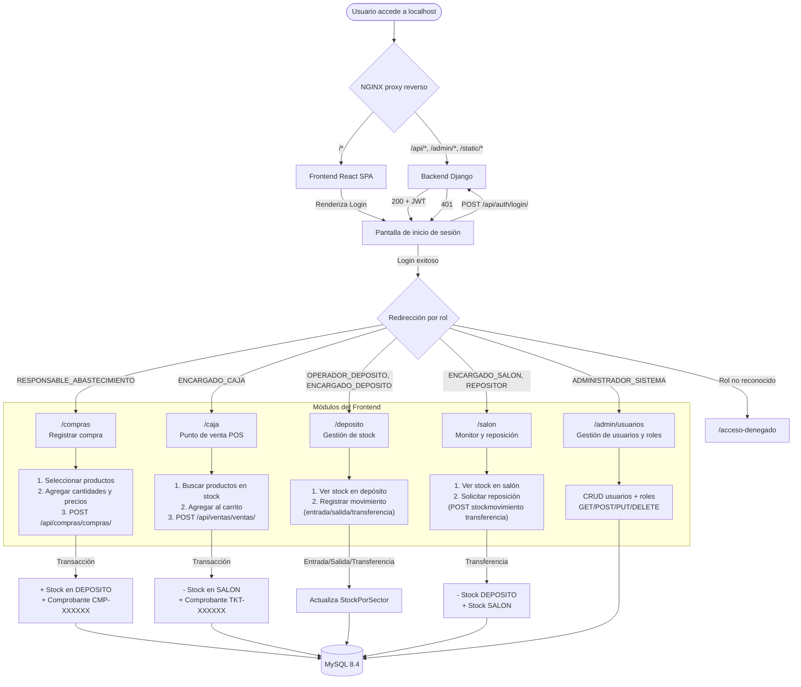

# Documentación del Sistema LogiRaf

## 1. Definiciones y especificación de requerimientos

### Definición general del proyecto

**LogiRaf** es un sistema de gestión logística y de inventario diseñado para comercios minoristas que necesitan controlar el flujo de mercadería desde la recepción en depósito hasta la venta en salón. El sistema consta de un frontend web (_React + Vite_) y una API REST (_Django + Django REST Framework_) que permite administrar usuarios con roles específicos, registrar compras de abastecimiento, controlar stock por sectores físicos (depósito y salón de ventas), registrar ventas con generación automática de comprobantes y mantener una trazabilidad completa de todos los movimientos de inventario.

Los propósitos fundamentales del sistema son:

- Centralizar la información de inventario en una única plataforma accesible desde cualquier dispositivo con navegador web.
- Establecer un control de acceso basado en roles que restrinja las operaciones según el perfil del usuario.
- Automatizar la actualización de stock al registrar compras y ventas, eliminando la intervención manual y reduciendo errores.
- Proveer una trazabilidad completa de los movimientos de mercadería mediante un registro de auditoría.
- Contener toda la infraestructura de desarrollo en contenedores Docker para facilitar la portabilidad y la replicabilidad del entorno.

### Usuarios

El sistema está orientado a empleados de un comercio minorista con distintos niveles de responsabilidad. La interacción se realiza a través de una interfaz web (frontend React) que consume la API REST. Los perfiles definidos son:

| Perfil | Descripción | Nivel técnico esperado |
|---|---|---|
| Administrador del sistema | Gestiona usuarios, roles y configuración general | Básico / Medio |
| Responsable de abastecimiento | Realiza compras y gestiona el ingreso de mercadería al depósito | Básico |
| Operador de depósito | Maneja el stock dentro del depósito y realiza movimientos internos | Básico |
| Encargado de depósito | Supervisa el depósito y aprueba movimientos de stock | Básico |
| Encargado de caja | Registra ventas (POS) y genera comprobantes | Básico |
| Encargado de salón | Gestiona el stock en el salón de ventas | Básico |
| Repositor | Repone mercadería del depósito al salón | Básico |

### Especificación de requerimientos

#### Requerimientos funcionales

- **RF-01:** El sistema debe permitir la creación y gestión de usuarios con contraseñas hash.
- **RF-02:** El sistema debe autenticar usuarios mediante tokens JWT (access + refresh).
- **RF-03:** El sistema debe autorizar operaciones según el rol del usuario autenticado.
- **RF-04:** El sistema debe permitir crear, leer, actualizar y eliminar productos.
- **RF-05:** El sistema debe permitir categorizar productos.
- **RF-06:** El sistema debe gestionar dos sectores físicos: depósito y salón de ventas.
- **RF-07:** El sistema debe mantener un registro de stock por producto y sector.
- **RF-08:** El sistema debe registrar cada movimiento de stock (entrada, salida, transferencia) con fecha y sectores involucrados.
- **RF-09:** El sistema debe validar que no se puedan realizar salidas de stock si la cantidad disponible es insuficiente.
- **RF-10:** El sistema debe permitir registrar compras de abastecimiento con múltiples productos.
- **RF-11:** Al registrar una compra, el sistema debe generar automáticamente un comprobante único y actualizar el stock del depósito.
- **RF-12:** El sistema debe permitir registrar ventas con múltiples productos.
- **RF-13:** Al registrar una venta, el sistema debe generar automáticamente un comprobante único y descontar el stock del salón.
- **RF-14:** Las operaciones de compra y venta deben ser atómicas (transaccionales).
- **RF-15:** El sistema debe exponer un frontend web que consuma la API y permita la interacción visual.
- **RF-16:** El frontend debe redirigir al módulo correspondiente según el rol del usuario autenticado.
- **RF-17:** El frontend debe proteger las rutas verificando autenticación y rol antes de renderizar.

#### Alcance

El sistema cubre la gestión completa del ciclo de inventario: compra → ingreso a depósito → transferencia a salón → venta. Incluye autenticación, autorización por roles, CRUD de entidades principales, generación de comprobantes y una interfaz web funcional para todos los perfiles.

#### Limitaciones

- El sistema no incluye un módulo de reportes o estadísticas operativo (la app `reportes` está definida pero deshabilitada).
- No implementa pasarela de pagos ni integración con sistemas contables externos.
- Los precios se toman del producto al momento de la venta; no hay gestión de precios históricos ni descuentos.
- No hay límite de stock máximo configurable; solo se valida stock mínimo para salidas.
- No se implementó autenticación por permisos a nivel de objeto (solo a nivel de vista), por lo que un usuario con el rol adecuado puede modificar cualquier registro de su dominio.

### Información de autoría y Legacy

El proyecto **LogiRaf** es un desarrollo original creado específicamente para la gestión logística de un comercio minorista. No deriva de ningún sistema preexistente ni implementa retrocompatibilidad con versiones anteriores. El repositorio se encuentra en `https://github.com/sebapalavecino2003/LogiRaf`.

**Autor:** Sebastián Palavecino (seba1junio@gmail.com)

### Procedimientos de desarrollo e instalación

#### Herramientas utilizadas

| Herramienta | Versión | Propósito |
|---|---|---|
| Python | 3.12 | Lenguaje de programación del backend |
| Django | 6.0.4 | Framework web del backend |
| Django REST Framework | 3.17.1 | Construcción de la API REST |
| MySQL | 8.4 | Motor de base de datos |
| SimpleJWT | 5.5.1 | Autenticación por tokens JWT |
| django-cors-headers | 4.9.0 | Manejo de CORS |
| django-filter | 25.2 | Filtrado de resultados en la API |
| React | 18.3.1 | Biblioteca de interfaz de usuario (frontend) |
| Vite | 5.4.21 | Empaquetador y servidor de desarrollo del frontend |
| React Router DOM | 6.24.0 | Enrutamiento del lado del cliente |
| Node.js | 20 | Entorno de ejecución del frontend |
| Docker | — | Contenedorización de servicios |
| Docker Compose | — | Orquestación de contenedores |
| NGINX | Alpine | Proxy reverso para desarrollo |
| Visual Studio Code | — | Entorno de desarrollo |

#### Planificación

El desarrollo se organizó siguiendo una estrategia incremental basada en módulos funcionales:

1. Configuración del proyecto Django y definición del modelo de datos.
2. Implementación del módulo de usuarios con autenticación JWT y permisos por roles.
3. Implementación del módulo de inventario con productos, categorías, sectores y gestión de stock.
4. Implementación del módulo de compras con generación de comprobantes y actualización atómica de stock.
5. Implementación del módulo de ventas con descuento de stock y generación de comprobantes.
6. Desarrollo del frontend React con enrutamiento protegido y módulos por rol.
7. Contenedorización con Docker y proxy reverso con NGINX.
8. Migración de base de datos SQLite a MySQL.
9. Pruebas de integración y validación de flujos completos.

#### Requisitos no funcionales

- **Seguridad:** Las contraseñas se almacenan con hash (PBKDF2/SHA256 por defecto en Django). La autenticación se realiza mediante tokens JWT con expiración. El frontend almacena los tokens en `localStorage` y renueva automáticamente el access token mediante el refresh token.
- **Atomicidad:** Las operaciones de compra y venta se ejecutan dentro de transacciones de base de datos para garantizar consistencia.
- **Disponibilidad:** El sistema funciona como API REST stateless, permitiendo escalado horizontal del backend.
- **Portabilidad:** Todo el entorno se ejecuta en contenedores Docker, garantizando reproducibilidad en cualquier sistema que soporte Docker Engine.

#### Obtención e instalación

**Requisitos previos:**
- Docker Engine 24+ y Docker Compose v2 instalados.
- Git para clonar el repositorio (opcional).

**Pasos (con Docker — recomendado para desarrollo):**

```bash
# 1. Clonar el repositorio
git clone https://github.com/sebapalavecino2003/LogiRaf.git
cd LogiRaf

# 2. Construir e iniciar todos los servicios
docker compose up --build
```

Una vez que todos los servicios estén operativos, los puntos de acceso son:

| Servicio | URL | Propósito |
|---|---|---|
| Frontend (vía NGINX) | `http://localhost` | Interfaz web del ERP |
| API (vía NGINX) | `http://localhost/api/...` | API REST |
| Admin Django | `http://localhost/admin/` | Panel de administración |
| Backend (directo) | `http://localhost:8000` | Solo para depuración |

**Pasos (sin Docker — solo backend):**

```bash
# 1. Clonar el repositorio
git clone https://github.com/sebapalavecino2003/LogiRaf.git
cd LogiRaf

# 2. Crear y activar un entorno virtual
python -m venv venv
source venv/bin/activate  # En Linux/Mac

# 3. Instalar dependencias del backend
pip install -r backend/requirements.txt

# 4. Configurar la base de datos MySQL
#    Crear una base de datos llamada 'logiraf' y un usuario 'logiraf'
#    O definir las variables de entorno MYSQL_* para conectar

# 5. Ejecutar migraciones
cd backend
python manage.py migrate

# 6. (Opcional) Crear un superusuario administrador
python manage.py create_admin --username admin --email admin@email.com --password mi_contraseña

# 7. Iniciar el servidor de desarrollo
python manage.py runserver
```

#### Especificaciones de prueba y ejecución

| Aspecto | Detalle |
|---|---|
| Entorno de ejecución | Contenedores Docker o servidor local |
| Puerto principal (NGINX) | 80 |
| Puerto backend | 8000 |
| Puerto frontend (Vite) | 5173 |
| Base de datos | MySQL 8.4 (contenedor Docker) |
| Modo DEBUG | Activado (desarrollo) |
| Autenticación | JWT (Endpoint: `POST /api/auth/login/`) |
| Cliente recomendado | Navegador web (frontend) o curl/Postman (API directa) |

Para verificar rápidamente que el sistema funciona:

```bash
# Obtener token JWT
curl -X POST http://localhost/api/auth/login/ \
  -H "Content-Type: application/json" \
  -d '{"username": "admin", "password": "mi_contraseña"}'

# Consultar usuario autenticado
curl http://localhost/api/usuarios/me/ \
  -H "Authorization: Bearer <token>"
```

---

## 2. Arquitectura del sistema

### Descripción jerárquica

LogiRaf sigue una arquitectura de **dos capas desplegadas en contenedores**:

1. **Frontend (React + Vite):** Aplicación de página única (SPA) que se ejecuta en el navegador. Consume la API REST y maneja el enrutamiento del lado del cliente mediante React Router DOM.
2. **Backend (Django + DRF):** API REST monolítica modular que expone endpoints para cada dominio funcional. Implementa el patrón MTV adaptado a REST con una capa de servicios (Service Layer) para la lógica de negocio.

Ambos componentes se despliegan mediante Docker Compose, con NGINX como proxy reverso que unifica la entrada en un único puerto (80).

```
LogiRaf/
├── docker-compose.yml         # Orquestación de contenedores
├── .dockerignore
├── backend/                   # API Django
│   ├── Dockerfile
│   ├── entrypoint.sh          # Migraciones automáticas al arrancar
│   ├── requirements.txt
│   ├── config/                # Configuración del proyecto Django
│   │   ├── settings.py        # Configuración (apps, DB MySQL, auth, CORS, JWT)
│   │   ├── urls.py            # Enrutador principal de la API
│   │   ├── views.py           # Vista SPA fallback
│   │   ├── wsgi.py / asgi.py
│   ├── usuarios/              # Módulo de usuarios y roles
│   ├── inventario/            # Módulo de inventario y stock
│   ├── compras/               # Módulo de compras y abastecimiento
│   └── ventas/                # Módulo de ventas
├── frontend/                  # SPA React
│   ├── Dockerfile
│   ├── vite.config.js
│   ├── src/
│   │   ├── main.jsx           # Punto de entrada
│   │   ├── App.jsx            # Árbol de rutas
│   │   ├── context/           # AuthContext (estado global de autenticación)
│   │   ├── services/          # Cliente HTTP con auto-refresh JWT
│   │   ├── components/        # Componentes reutilizables
│   │   │   └── routing/       # ProtectedRoute
│   │   ├── layouts/           # DashboardLayout (sidebar + navbar)
│   │   ├── pages/             # Páginas/módulos del ERP
│   │   │   ├── Login.jsx
│   │   │   ├── admin/         # AdminSistema (usuarios y roles)
│   │   │   ├── compras/       # ModuloCompras
│   │   │   ├── deposito/      # ModuloDeposito
│   │   │   ├── caja/          # ModuloCaja (POS)
│   │   │   └── salon/         # ModuloSalon
│   │   └── styles/            # CSS global (1297 líneas)
│   └── public/
└── nginx/
    └── nginx.conf             # Configuración de proxy reverso
```

Cada aplicación de Django sigue una estructura interna homogénea:

- `models.py` — Definición de entidades y relaciones.
- `views.py` — ViewSets de DRF que exponen los endpoints.
- `serializers.py` — Serializadores que transforman datos entre la API y el modelo.
- `services.py` — Lógica de negocio encapsulada (patrón Service Layer).
- `urls.py` — Enrutamiento interno de la aplicación.
- `permisos.py` — Clases de permisos personalizados (solo en `usuarios/`).
- `admin.py` — Configuración del panel de administración de Django.

### Diagrama de módulos

```mermaid
graph TD
    subgraph "Cliente (Navegador)"
        REACT["Frontend React SPA<br/>(Vite + React Router)"]
    end

    subgraph "Proxy Reverso (Docker)"
        NGINX["NGINX<br/>localhost:80"]
    end

    subgraph "Backend Django (Docker)"
        AUTH["Autenticación JWT<br/>POST /api/auth/login/"]
        CONFIG["Enrutador Principal<br/>config/urls.py"]
        USUARIOS["Módulo Usuarios<br/>api/usuarios/"]
        INVENTARIO["Módulo Inventario<br/>api/inventario/"]
        COMPRAS["Módulo Compras<br/>api/compras/"]
        VENTAS["Módulo Ventas<br/>api/ventas/"]
        FALLBACK["SPA Fallback<br/>config/views.py"]
    end

    subgraph "Capa de Negocio (Service Layer)"
        USERVICE["UsuarioService<br/>crear_usuario()"]
        STOCKSERVICE["StockService<br/>procesar_movimiento()"]
        COMPSERVICE["CompraService<br/>crear_compra()"]
        VENTSERVICE["VentaService<br/>crear_venta()"]
    end

    subgraph "Base de Datos (Docker)"
        MYSQL["MySQL 8.4<br/>logiraf"]
    end

    REACT -->|localhost:80| NGINX

    NGINX -->|/api/* /admin/* /static/*| CONFIG
    NGINX -->|/* (SPA)| REACT

    CONFIG --> AUTH
    CONFIG --> USUARIOS
    CONFIG --> INVENTARIO
    CONFIG --> COMPRAS
    CONFIG --> VENTAS
    CONFIG --> FALLBACK

    USUARIOS --> USERVICE
    INVENTARIO --> STOCKSERVICE
    COMPRAS --> COMPSERVICE
    VENTAS --> VENTSERVICE

    USERVICE --> MYSQL
    STOCKSERVICE --> MYSQL
    COMPSERVICE --> MYSQL
    VENTSERVICE --> MYSQL
```

### Descripción individual de los módulos

#### Frontend (React + Vite)

- **Descripción:** Aplicación de página única que proporciona la interfaz gráfica del ERP. Desarrollada con React 18, empaquetada con Vite 5 y con enrutamiento del lado del cliente mediante React Router DOM 6.
- **Responsabilidad:** Proveer una interfaz visual para cada módulo del sistema, autenticar usuarios mediante JWT, proteger rutas según el rol y comunicarse con el backend a través de HTTP.
- **Restricciones:** Depende completamente de la API REST para datos y operaciones. No tiene lógica de negocio propia más allá de la validación de formularios.
- **Dependencias:** `react`, `react-dom`, `react-router-dom`; se comunica con el backend mediante `fetch`.
- **Implementación:** `frontend/src/`.

#### Módulo `config` (Configuración del proyecto Django)

- **Descripción:** Contiene la configuración global del proyecto Django: aplicaciones instaladas, middleware, base de datos MySQL, autenticación JWT, CORS y enrutamiento raíz.
- **Responsabilidad:** Orquestar la carga del proyecto, definir la configuración de seguridad y distribuir las peticiones entrantes a las aplicaciones correspondientes. Incluye una vista fallback para el SPA.
- **Restricciones:** No implementa lógica de negocio.
- **Dependencias:** Django, DRF, SimpleJWT, django-cors-headers, django-filter.
- **Implementación:** `backend/config/`.

#### Módulo `usuarios` (Usuarios y Roles)

- **Descripción:** Gestiona la autenticación, los roles y el registro de usuarios del sistema. Define las clases de permisos personalizados que consumen los demás módulos.
- **Responsabilidad:** Proveer CRUD de usuarios y roles, autenticar mediante JWT (login + refresh) y exponer el endpoint `/me/` para obtener el usuario autenticado.
- **Restricciones:** No puede crear usuarios sin contraseña ni username. El rol `ADMINISTRADOR_SISTEMA` se asigna automáticamente al superusuario.
- **Dependencias:** Django REST Framework, SimpleJWT.
- **Implementación:** `backend/usuarios/`.

#### Módulo `inventario` (Inventario y Stock)

- **Descripción:** Gestiona productos, categorías, sectores físicos y el control de stock con trazabilidad de movimientos.
- **Responsabilidad:** Mantener el catálogo de productos, registrar la cantidad disponible por sector y procesar movimientos de entrada, salida y transferencia, validando stock suficiente.
- **Restricciones:** No puede realizar salidas de stock si la cantidad disponible es insuficiente. El movimiento de tipo `entrada` requiere un sector destino; `salida` requiere un sector origen; `transferencia` requiere ambos.
- **Dependencias:** Django REST Framework. Los servicios son consumidos por `compras` y `ventas`.
- **Implementación:** `backend/inventario/`.

#### Módulo `compras` (Compras y Abastecimiento)

- **Descripción:** Gestiona las compras de mercadería realizadas por el responsable de abastecimiento.
- **Responsabilidad:** Registrar compras con múltiples productos, generar comprobantes únicos con formato `CMP-XXXXXX` y actualizar automáticamente el stock del depósito mediante movimientos de entrada.
- **Restricciones:** Solo los usuarios con rol `RESPONSABLE_ABASTECIMIENTO` pueden acceder. La operación es transaccional: si falla algún paso, se revierte toda la compra.
- **Dependencias:** `inventario` (modelos Sector, StockMovimiento; servicio StockService).
- **Implementación:** `backend/compras/`.

#### Módulo `ventas` (Ventas)

- **Descripción:** Gestiona las ventas realizadas en el salón o caja del comercio.
- **Responsabilidad:** Registrar ventas con múltiples productos, generar comprobantes únicos con formato `TKT-XXXXXX` y descontar automáticamente el stock del salón mediante movimientos de salida.
- **Restricciones:** La lectura de ventas es pública; la escritura requiere rol `ENCARGADO_CAJA` o `is_staff=True`. La operación es transaccional.
- **Dependencias:** `inventario` (modelos Sector, StockMovimiento).
- **Implementación:** `backend/ventas/`.

#### NGINX (Proxy Reverso)

- **Descripción:** Servidor web que actúa como proxy reverso unificando el frontend y el backend en un único puerto (80).
- **Responsabilidad:** Enrutar las peticiones `/api/`, `/admin/` y `/static/` al backend Django, y el resto (incluyendo WebSocket de HMR de Vite) al frontend.
- **Restricciones:** Solo opera en modo proxy; no sirve archivos estáticos por sí mismo (delega en Django).
- **Dependencias:** Backend (puerto 8000), Frontend (puerto 5173).
- **Implementación:** `nginx/nginx.conf`.

### Dependencias externas y aspectos técnicos

#### Backend (Python)

| Librería | Versión | Propósito | Justificación de diseño |
|---|---|---|---|
| Django | 6.0.4 | Framework web completo | Madurez, seguridad integrada, ORM robusto y comunidad extensa. |
| Django REST Framework | 3.17.1 | Construcción de APIs REST | Estándar de facto para APIs REST con Django. ViewSets, Serializers y autenticación integrada. |
| SimpleJWT | 5.5.1 | Autenticación JWT | Ligero, bien integrado con DRF, soporta refresh tokens. |
| django-cors-headers | 4.9.0 | Cabeceras CORS | Necesario para permitir peticiones desde un frontend en origen diferente. |
| django-filter | 25.2 | Filtrado de querysets | Permite filtrar resultados de la API mediante parámetros URL. |
| mysqlclient | 2.2.8 | Conector MySQL para Django | Controlador nativo recomendado por Django para MySQL. |

#### Frontend (JavaScript)

| Librería | Versión | Propósito | Justificación de diseño |
|---|---|---|---|
| React | 18.3.1 | Biblioteca de interfaz de usuario | Ecosistema maduro, componentes reutilizables, hooks. |
| Vite | 5.4.21 | Empaquetador y servidor de desarrollo | Extremadamente rápido (ESBuild nativo), HMR instantáneo. |
| React Router DOM | 6.24.0 | Enrutamiento del lado del cliente | Estándar para React, enrutamiento anidado, loaders. |

#### Infraestructura

| Componente | Versión | Propósito |
|---|---|---|
| Docker | — | Contenedorización de servicios |
| MySQL | 8.4 | Base de datos relacional |
| NGINX | Alpine | Proxy reverso |

---

## 3. Diseño del modelo de datos

### Modelo de datos agnóstico

El sistema maneja trece entidades principales que representan el dominio logístico:

**Rol** — Representa un perfil de usuario con permisos específicos dentro del sistema. Cada rol tiene un nombre único entre siete opciones fijas: `OPERADOR_DEPOSITO`, `ENCARGADO_DEPOSITO`, `REPOSITOR`, `ENCARGADO_SALON`, `ENCARGADO_CAJA`, `RESPONSABLE_ABASTECIMIENTO` y `ADMINISTRADOR_SISTEMA`.

**Usuario** — Representa una persona que opera el sistema. Extiende la entidad `AbstractUser` de Django y agrega una referencia obligatoria a un `Rol` mediante `ForeignKey` con protección de borrado (`PROTECT`). Se autentica mediante username y contraseña.

**Categoria** — Agrupación lógica de productos (ej: "Limpieza", "Almacén", "Bebidas"). No tiene jerarquía ni subcategorías. Un producto pertenece exactamente a una categoría.

**Producto** — Artículo comercializado. Posee nombre, marca, talle (opcional), descripción (opcional), precio unitario (decimal de hasta 10 dígitos con 4 decimales) y pertenece a una categoría mediante `ForeignKey` con protección de borrado.

**Sector** — Ubicación física del inventario. Solo existen dos valores: `DEPOSITO` (almacén principal) y `SALON` (salón de ventas). Es una entidad única por tipo.

**StockPorSector** — Relación muchos a muchos entre `Producto` y `Sector` que cuantifica el stock disponible. La combinación producto + sector es única. La cantidad es un entero positivo.

**StockMovimiento** — Registro de auditoría que documenta cada cambio en el inventario. Almacena el tipo de movimiento (`entrada`, `salida`, `transferencia`), los sectores involucrados (origen y/o destino según el tipo), la cantidad, la fecha y el producto. Las validaciones aseguran que `entrada` tenga sector_destino, `salida` tenga sector_origen y `transferencia` tenga ambos.

**Compra** — Orden de abastecimiento. Contiene la fecha (automática), el total y el usuario responsable (solo rol `RESPONSABLE_ABASTECIMIENTO`).

**DetalleCompra** — Línea individual dentro de una compra. Asocia un producto, cantidad y precio unitario.

**ComprobanteCompra** — Comprobante fiscal asociado uno a uno con una compra. Su número se genera automáticamente con formato `CMP-XXXXXX` (UUID de 6 caracteres hexadecimales en mayúsculas).

**Comprobante** — Comprobante de venta, independiente del de compra. Su número se genera automáticamente con formato `TKT-XXXXXX`.

**Venta** — Transacción de venta que vincula un `Comprobante` (OneToOne), un `vendedor` (Usuario con rol `ENCARGADO_CAJA` o `ENCARGADO_SALON`) y una fecha automática.

**DetalleVenta** — Línea individual dentro de una venta. Asocia un producto, cantidad y precio unitario de venta.

### Diagrama del modelo

```mermaid
erDiagram
    Rol {
        int id_rol PK
        string nombre_rol UK
    }

    Usuario {
        int id_usuario PK
        string username UK
        string password
        string nombre_completo
        string first_name
        string last_name
        string email
        boolean is_staff
        boolean is_active
        date date_joined
        int rol_id FK
    }

    Categoria {
        int id_categoria PK
        string nombre_categoria
    }

    Producto {
        int id_producto PK
        string nombre_producto
        string marca
        string talle
        text descripcion_producto
        decimal precio_unitario
        int categoria_id FK
    }

    Sector {
        int id PK
        string tipo UK
        text descripcion
    }

    StockPorSector {
        int id PK
        int producto_id FK
        int sector_id FK
        int cantidad
    }

    StockMovimiento {
        int id PK
        int producto_id FK
        string tipo
        int sector_origen_id FK
        int sector_destino_id FK
        int cantidad
        datetime fecha
    }

    Compra {
        int id_compra PK
        datetime fecha_compra
        decimal total_compra
        int responsable_abastecimiento_id FK
    }

    DetalleCompra {
        int id PK
        int compra_id FK
        int producto_id FK
        int cantidad
        decimal precio_unitario
    }

    ComprobanteCompra {
        int id PK
        int compra_id FK UK
        string numero_comprobante UK
        datetime fecha_emision
    }

    Comprobante {
        int id_comprobante PK
        string numero_comprobante UK
        datetime fecha_emision
    }

    Venta {
        int id_venta PK
        datetime fecha_venta
        int comprobante_id FK UK
        int vendedor_id FK
    }

    DetalleVenta {
        int id_detalle PK
        int venta_id FK
        int producto_id FK
        int cantidad
        decimal precio_unitario_venta
    }

    Rol ||--o{ Usuario : "tiene"
    Categoria ||--o{ Producto : "clasifica"
    Producto ||--o{ StockPorSector : "tiene stock en"
    Sector ||--o{ StockPorSector : "contiene"
    Producto ||--o{ StockMovimiento : "registra movimiento"
    Sector ||--o{ StockMovimiento : "origen"
    Sector ||--o{ StockMovimiento : "destino"
    Usuario ||--o{ Compra : "realiza"
    Compra ||--o{ DetalleCompra : "contiene"
    Compra ||--|| ComprobanteCompra : "genera"
    Comprobante ||--|| Venta : "asociado a"
    Usuario ||--o{ Venta : "vende"
    Venta ||--o{ DetalleVenta : "contiene"
    Producto ||--o{ DetalleCompra : "incluido en"
    Producto ||--o{ DetalleVenta : "incluido en"
```

### Tipos de datos

#### Datos de entrada

Provienen de las peticiones HTTP (cuerpo JSON de las solicitudes POST/PUT/PATCH):

| Entidad / Caso | Campos de entrada | Tipo |
|---|---|---|
| Login | `username` (string), `password` (string) | JSON |
| Crear usuario | `username`, `password`, `first_name`, `last_name`, `rol` (ID) | JSON |
| Crear producto | `nombre_producto`, `marca`, `talle` (opcional), `descripcion_producto` (opcional), `precio_unitario`, `id_categoria` | JSON |
| Crear compra | `total_compra` (decimal), `responsable_abastecimiento` (ID), `detalles` (array de: `producto`, `cantidad`, `precio_unitario`) | JSON |
| Crear venta | `vendedor` (ID), `items` (array de: `producto`, `cantidad`) | JSON |
| Movimiento stock | `id_producto`, `tipo`, `id_sector_origen` (opcional), `id_sector_destino` (opcional), `cantidad` | JSON |

#### Datos internos

Corresponden al estado persistente en la base de datos MySQL:

- Todos los modelos descritos en el diagrama entidad-relación.
- Tablas auxiliares de Django (`auth_permission`, `django_session`, `django_migrations`, etc.).
- Las contraseñas se almacenan con hash (PBKDF2/SHA256, nunca en texto plano).

#### Datos de salida

Son las respuestas JSON que la API REST devuelve al cliente:

- **Éxito:** Objeto JSON con los campos del modelo serializado (lectura), o código HTTP 201 (creación), o código HTTP 200 (actualización/eliminación).
- **Error:** Objeto JSON con campo `detail` o `errores` describiendo la falla, acompañado del código HTTP correspondiente (400, 401, 403, 404, 500).
- **Autenticación:** `{"access": "<token>", "refresh": "<token>"}` en login exitoso.

---

## 4. Descripción de procesos y servicios ofrecidos

### Servicios del sistema

#### Autenticación de usuarios
Permite a cualquier usuario registrado obtener un par de tokens JWT (access y refresh) enviando sus credenciales a `POST /api/auth/login/`. El token access se debe incluir en el encabezado `Authorization: Bearer <token>` de las peticiones subsiguientes. El frontend almacena los tokens en `localStorage` y renueva automáticamente el access token mediante el refresh token cuando expira. Si el refresh falla, redirige al login y limpia la sesión.

#### Redirección por rol
Cuando un usuario inicia sesión, el frontend lo redirige al módulo correspondiente según su rol (ej: `ADMINISTRADOR_SISTEMA` → `/admin/usuarios`, `ENCARGADO_CAJA` → `/caja`). Si el rol no está reconocido, se muestra una página de acceso denegado.

#### Protección de rutas
Todas las rutas del frontend (excepto `/login`) están envueltas en un componente `ProtectedRoute` que verifica:
1. Que el usuario esté autenticado (token JWT válido).
2. Que el usuario tenga el rol requerido para acceder a esa ruta.
3. Si no está autenticado, redirige a `/login`. Si no tiene el rol, redirige a `/acceso-denegado`.

#### Creación de usuarios (`UsuarioService.crear_usuario`)
Valida que el username y la contraseña estén presentes, verifica que el username no exista previamente, crea el objeto `Usuario` con la contraseña hasheada y lo persiste en la base de datos.

#### Procesamiento de movimientos de stock (`StockService.procesar_movimiento`)
Ejecuta la lógica de actualización de stock según el tipo de movimiento:

- **Entrada:** Incrementa la cantidad del producto en el sector destino. Si no existe un registro `StockPorSector` para esa combinación, lo crea.
- **Salida:** Disminuye la cantidad del producto en el sector origen. Valida que el stock disponible sea suficiente.
- **Transferencia:** Disminuye la cantidad en el sector origen y la incrementa en el sector destino. Valida stock suficiente en el origen.

Todas las operaciones se ejecutan dentro de una transacción de base de datos (`@transaction.atomic`).

#### Registro de compras (`CompraService.crear_compra`)
Proceso transaccional que:
1. Crea el registro `Compra`.
2. Genera un `ComprobanteCompra` único con formato `CMP-XXXXXX`.
3. Por cada producto en el detalle, crea un `DetalleCompra` y un `StockMovimiento` de tipo `entrada` con destino al sector `DEPOSITO`.

#### Registro de ventas (`VentaService.crear_venta`)
Proceso transaccional que:
1. Genera un `Comprobante` único con formato `TKT-XXXXXX`.
2. Crea el registro `Venta` asociado al comprobante y al vendedor.
3. Por cada producto, crea un `DetalleVenta` y un `StockMovimiento` de tipo `salida` con origen en el sector `SALON`.

### Diagrama de flujo



---

## 5. Documentación técnica — Especificación API (Manual del Programador)

### Endpoints de autenticación

| Método | Ruta | Propósito |
|---|---|---|
| POST | `/api/auth/login/` | Obtener tokens JWT (access y refresh) |
| POST | `/api/auth/refresh/` | Renovar token access mediante token refresh |

#### `POST /api/auth/login/`

- **Propósito:** Autenticar un usuario y obtener un par de tokens JWT.
- **Cuerpo:**
  - `username` (string, obligatorio) — Nombre de usuario.
  - `password` (string, obligatorio) — Contraseña del usuario.
- **Respuesta exitosa (200):**
  ```json
  {
    "access": "eyJhbGciOiJI...",
    "refresh": "eyJhbGciOiJI..."
  }
  ```
- **Respuesta de error (401):**
  ```json
  {
    "detail": "No active account found with the given credentials"
  }
  ```

#### `POST /api/auth/refresh/`

- **Propósito:** Obtener un nuevo token access a partir de un token refresh válido.
- **Cuerpo:**
  - `refresh` (string, obligatorio) — Token refresh recibido en el login.
- **Respuesta exitosa (200):**
  ```json
  {
    "access": "eyJhbGciOiJI..."
  }
  ```

### Endpoints de usuarios

**Base URL:** `/api/usuarios/`

| Método | Ruta | Propósito | Permiso |
|---|---|---|---|
| GET | `/api/usuarios/me/` | Obtener usuario autenticado | Requiere JWT |
| GET | `/api/usuarios/usuarios/` | Listar usuarios | Requiere JWT |
| POST | `/api/usuarios/usuarios/` | Crear usuario | Requiere JWT |
| GET | `/api/usuarios/usuarios/{id}/` | Obtener usuario | Requiere JWT |
| PUT/PATCH | `/api/usuarios/usuarios/{id}/` | Actualizar usuario | Requiere JWT |
| DELETE | `/api/usuarios/usuarios/{id}/` | Eliminar usuario | Requiere JWT |
| GET | `/api/usuarios/roles/` | Listar roles | Requiere JWT |
| POST | `/api/usuarios/roles/` | Crear rol | Requiere JWT |
| GET | `/api/usuarios/roles/{id}/` | Obtener rol | Requiere JWT |
| PUT/PATCH | `/api/usuarios/roles/{id}/` | Actualizar rol | Requiere JWT |
| DELETE | `/api/usuarios/roles/{id}/` | Eliminar rol | Requiere JWT |

#### `GET /api/usuarios/me/`

- **Propósito:** Obtener los datos del usuario autenticado mediante el token JWT.
- **Encabezado:** `Authorization: Bearer <token>`
- **Respuesta exitosa (200):**
  ```json
  {
    "id_usuario": 1,
    "username": "admin",
    "first_name": "",
    "last_name": "",
    "rol": { "id_rol": 7, "nombre_rol": "ADMINISTRADOR_SISTEMA" }
  }
  ```

#### `POST /api/usuarios/usuarios/`

- **Propósito:** Crear un nuevo usuario en el sistema.
- **Cuerpo:**
  - `username` (string, obligatorio) — Nombre de usuario único.
  - `password` (string, obligatorio) — Contraseña (solo escritura).
  - `first_name` (string, opcional) — Nombre de pila.
  - `last_name` (string, opcional) — Apellido.
  - `rol` (int, obligatorio) — ID del rol asignado.
- **Respuesta exitosa (201):** Objeto JSON con `id_usuario`, `username`, `first_name`, `last_name`, `rol` (objeto anidado).
- **Validaciones:** El username no debe existir previamente. Password mínimo de 8 caracteres.

### Endpoints de inventario

**Base URL:** `/api/inventario/`

| Método | Ruta | Propósito |
|---|---|---|
| GET, POST | `/api/inventario/categorias/` | Listar / Crear categorías |
| GET, PUT, PATCH, DELETE | `/api/inventario/categorias/{id}/` | CRUD categoría individual |
| GET, POST | `/api/inventario/productos/` | Listar / Crear productos |
| GET, PUT, PATCH, DELETE | `/api/inventario/productos/{id}/` | CRUD producto individual |
| GET, POST | `/api/inventario/sectores/` | Listar / Crear sectores |
| GET, PUT, PATCH, DELETE | `/api/inventario/sectores/{id}/` | CRUD sector individual |
| GET, POST | `/api/inventario/stockporsector/` | Listar / Crear stock por sector |
| GET, PUT, PATCH, DELETE | `/api/inventario/stockporsector/{id}/` | CRUD stock individual |
| GET, POST | `/api/inventario/stockmovimiento/` | Listar / Crear movimientos |
| GET, PUT, PATCH, DELETE | `/api/inventario/stockmovimiento/{id}/` | CRUD movimiento individual |

#### `POST /api/inventario/productos/`

- **Cuerpo:**
  - `nombre_producto` (string, obligatorio) — Nombre del producto.
  - `marca` (string, obligatorio) — Marca del producto.
  - `talle` (string, opcional) — Talle o variante.
  - `descripcion_producto` (texto, opcional) — Descripción detallada.
  - `precio_unitario` (decimal, obligatorio) — Precio unitario (hasta 4 decimales).
  - `id_categoria` (int, obligatorio) — ID de la categoría.
- **Respuesta (201):** Objeto JSON con todos los campos del producto, incluyendo `categoria` anidada.

#### `POST /api/inventario/stockmovimiento/`

- **Propósito:** Registrar un movimiento de stock. Al crearse, ejecuta automáticamente `StockService.procesar_movimiento()` para actualizar las cantidades en `StockPorSector`.
- **Cuerpo:**
  - `id_producto` (int, obligatorio) — ID del producto.
  - `tipo` (string, obligatorio) — `"entrada"`, `"salida"` o `"transferencia"`.
  - `id_sector_origen` (int, opcional) — Obligatorio para `salida` y `transferencia`.
  - `id_sector_destino` (int, opcional) — Obligatorio para `entrada` y `transferencia`.
  - `cantidad` (int, obligatorio) — Cantidad positiva.
- **Respuesta (201):** Objeto JSON del movimiento creado.
- **Validaciones:** `entrada` requiere `sector_destino`; `salida` requiere `sector_origen`; `transferencia` requiere ambos. No se permite salida si el stock es insuficiente.

### Endpoints de compras

**Base URL:** `/api/compras/`

| Método | Ruta | Propósito | Permiso |
|---|---|---|---|
| GET | `/api/compras/compras/` | Listar compras | `RESPONSABLE_ABASTECIMIENTO` |
| POST | `/api/compras/compras/` | Crear compra | `RESPONSABLE_ABASTECIMIENTO` |
| GET | `/api/compras/compras/{id}/` | Obtener compra | `RESPONSABLE_ABASTECIMIENTO` |
| PUT/PATCH | `/api/compras/compras/{id}/` | Actualizar compra | `RESPONSABLE_ABASTECIMIENTO` |
| DELETE | `/api/compras/compras/{id}/` | Eliminar compra | `RESPONSABLE_ABASTECIMIENTO` |

#### `POST /api/compras/compras/`

- **Propósito:** Registrar una compra de abastecimiento. Crea la compra, su comprobante, los detalles y los movimientos de stock de entrada al depósito, todo en una transacción.
- **Cuerpo:**
  - `total_compra` (decimal, obligatorio) — Monto total de la compra.
  - `responsable_abastecimiento` (int, obligatorio) — ID del usuario responsable.
  - `detalles` (array, obligatorio) — Lista de objetos con:
    - `producto` (int) — ID del producto.
    - `cantidad` (int) — Cantidad comprada.
    - `precio_unitario` (decimal) — Precio unitario al momento de la compra.
- **Respuesta (201):** Objeto JSON de la compra, incluyendo `detalles` y `comprobante_detalle` anidados.

### Endpoints de ventas

**Base URL:** `/api/ventas/`

| Método | Ruta | Propósito | Permiso |
|---|---|---|---|
| GET | `/api/ventas/ventas/` | Listar ventas | Público |
| POST | `/api/ventas/ventas/` | Crear venta | `ENCARGADO_CAJA` o staff |
| GET | `/api/ventas/ventas/{id}/` | Obtener venta | Público |
| PUT/PATCH | `/api/ventas/ventas/{id}/` | Actualizar venta | `ENCARGADO_CAJA` o staff |
| DELETE | `/api/ventas/ventas/{id}/` | Eliminar venta | `ENCARGADO_CAJA` o staff |
| GET | `/api/ventas/detalles/` | Listar detalles | Público (solo lectura) |
| GET | `/api/ventas/detalles/{id}/` | Obtener detalle | Público (solo lectura) |
| GET | `/api/ventas/comprobantes/` | Listar comprobantes | Público (solo lectura) |
| GET | `/api/ventas/comprobantes/{id}/` | Obtener comprobante | Público (solo lectura) |

#### `POST /api/ventas/ventas/`

- **Propósito:** Registrar una venta. Crea el comprobante, la venta, los detalles y los movimientos de stock de salida desde el salón, todo en una transacción.
- **Cuerpo:**
  - `vendedor` (int, obligatorio) — ID del usuario que realiza la venta.
  - `items` (array, obligatorio) — Lista de objetos con:
    - `producto` (int) — ID del producto.
    - `cantidad` (int) — Cantidad vendida.
- **Respuesta (201):** Objeto JSON de la venta, incluyendo `items`, `comprobante` (número y fecha) y `vendedor`.
- **Validaciones:** El vendedor debe existir. Debe haber stock suficiente en el sector `SALON` para cada producto.

### Clases de permisos personalizados

Definidas en `backend/usuarios/permisos.py`:

| Clase | Rol requerido | Uso |
|---|---|---|
| `EsAdmin` | `is_staff` | Acceso administrativo general |
| `EsOperadorDeposito` | `OPERADOR_DEPOSITO` | Operaciones en depósito |
| `EsEncargadoDeposito` | `ENCARGADO_DEPOSITO` | Supervisión de depósito |
| `EsVendedor` | `ENCARGADO_CAJA` | Registro de ventas |
| `EsRepositor` | `REPOSITOR` | Reposición de mercadería |
| `EsEncargadoSalon` | `ENCARGADO_SALON` | Gestión de salón |
| `EsResponsableAbastecimiento` | `RESPONSABLE_ABASTECIMIENTO` | Compras y abastecimiento |
| `PuedeIngresarMercaderia` | `OPERADOR_DEPOSITO` o `ENCARGADO_DEPOSITO` | Ingreso de mercadería |
| `PuedeAprobarMovimientos` | `ENCARGADO_DEPOSITO` | Aprobación de movimientos |
| `PuedeRegistrarVenta` | `ENCARGADO_CAJA` o `REPOSITOR` | Registro de ventas |

Todas las clases de permisos extienden `TieneRol` (o directamente `BasePermission`) y conceden acceso automático a usuarios con `is_staff=True`.

### Tipos de Datos Abstractos (TDAs)

#### `UsuarioService`

| Método | Descripción |
|---|---|
| `crear_usuario(data)` | Valida y crea un usuario con contraseña hasheada. Retorna el objeto `Usuario`. |

#### `StockService`

| Método | Descripción |
|---|---|
| `procesar_movimiento(movimiento)` | Aplica un movimiento de stock dentro de una transacción. Delega en `_entrada`, `_salida` o `_transferencia` según el tipo. |

#### `CompraService`

| Método | Descripción |
|---|---|
| `crear_compra(data, detalles_data)` | Ejecuta la transacción completa de compra: crea Compra, ComprobanteCompra, DetalleCompra y StockMovimiento de entrada. Retorna el objeto `Compra`. |

#### `VentaService`

| Método | Descripción |
|---|---|
| `crear_venta(data, items_data)` | Ejecuta la transacción completa de venta: crea Comprobante, Venta, DetalleVenta y StockMovimiento de salida. Retorna el objeto `Venta`. |

### Cliente HTTP del Frontend

El frontend implementa un cliente HTTP propio (`src/services/api.js`) con las siguientes características:

| Función | Propósito |
|---|---|
| `apiGet(ruta, params)` | GET con query params opcionales |
| `apiPost(ruta, cuerpo)` | POST con body JSON |
| `apiPut(ruta, cuerpo)` | PUT con body JSON |
| `apiPatch(ruta, cuerpo)` | PATCH con body JSON |
| `apiDelete(ruta)` | DELETE |
| `getAccessToken()` | Obtiene el token access de `localStorage` |
| `getRefreshToken()` | Obtiene el token refresh de `localStorage` |
| `setTokens(access, refresh)` | Almacena ambos tokens en `localStorage` |
| `clearTokens()` | Elimina los tokens de `localStorage` |

El cliente implementa renovación automática de tokens: si una petición recibe `401`, intenta renovar el access token usando el refresh token. Si la renovación falla, limpia la sesión y redirige al login.

### Árbol de rutas del Frontend

```
<BrowserRouter>
  <AuthProvider>
    <Routes>
      /login                          → Login.jsx (público)
      /                               → ProtectedRoute → DashboardLayout
        /                             → RedirectorRaiz (redirige por rol)
        /admin/usuarios               → ProtectedRoute(ADMINISTRADOR_SISTEMA) → AdminSistema
        /admin/roles                  → ProtectedRoute(ADMINISTRADOR_SISTEMA) → AdminSistema
        /compras                      → ProtectedRoute(RESPONSABLE_ABASTECIMIENTO) → ModuloCompras
        /deposito                     → ProtectedRoute(OPERADOR_DEPOSITO, ENCARGADO_DEPOSITO) → ModuloDeposito
        /caja                         → ProtectedRoute(ENCARGADO_CAJA) → ModuloCaja
        /salon                        → ProtectedRoute(ENCARGADO_SALON, REPOSITOR) → ModuloSalon
        /acceso-denegado              → AccesoDenegado
        *                             → redirect a /
    </Routes>
  </AuthProvider>
</BrowserRouter>
```

---

## 6. Manual del usuario final

### Instrucciones de invocación

El sistema LogiRaf se despliega mediante Docker Compose. No requiere instalación manual de dependencias más allá de Docker.

#### Sinopsis (Docker)

```bash
docker compose up --build
```

#### Sinopsis (desarrollo local, solo backend)

```bash
cd backend
python manage.py runserver [dirección:puerto]
```

#### Parámetros (docker compose)

| Parámetro | Obligatorio | Propósito | Comportamiento por defecto |
|---|---|---|---|
| `--build` | No | Reconstruir imágenes antes de iniciar | Usa imágenes cacheadas |

#### Parámetros (runserver)

| Parámetro | Obligatorio | Propósito | Comportamiento por defecto |
|---|---|---|---|
| `dirección` | No | Dirección IP de escucha | `127.0.0.1` |
| `puerto` | No | Puerto TCP de escucha | `8000` |

#### Comandos de gestión adicionales

```bash
# Crear un superusuario administrador (asigna rol ADMINISTRADOR_SISTEMA)
python manage.py create_admin --username <usuario> --email <email> --password <contraseña>

# Ejecutar migraciones de base de datos
python manage.py migrate

# Acceder al shell interactivo de Django
python manage.py shell

# Acceder a la consola MySQL dentro del contenedor
docker exec -it logiraf-mysql mysql -u logiraf -plogiraf_dev logiraf
```

### Flujo de operación (usuario final)

1. **Abrir el navegador** en `http://localhost`.
2. **Iniciar sesión** con credenciales de usuario (username y contraseña).
3. El sistema **redirige automáticamente** al módulo correspondiente según el rol del usuario.
4. **Navegación:** Usar la barra lateral izquierda para moverse entre las pantallas del módulo asignado.
5. **Cerrar sesión:** Botón "Cerrar sesión" al pie de la barra lateral.

#### Pantallas por rol

| Rol | Pantalla principal | Acciones disponibles |
|---|---|---|
| Administrador del sistema | `/admin/usuarios` | Crear, editar, eliminar usuarios y roles |
| Responsable de abastecimiento | `/compras` | Registrar compras con múltiples productos |
| Operador / Encargado de depósito | `/deposito` | Ver stock, registrar entradas/salidas/transferencias |
| Encargado de caja | `/caja` | POS: buscar productos, armar carrito, cobrar |
| Encargado de salón / Repositor | `/salon` | Ver stock, solicitar reposición desde depósito |

### Consumo directo de la API

Todas las rutas de la API están prefijadas bajo `http://localhost/api/`.

#### Flujo típico

```bash
# 1. Obtener token de autenticación
curl -X POST http://localhost/api/auth/login/ \
  -H "Content-Type: application/json" \
  -d '{"username": "admin", "password": "mi_contraseña"}'

# 2. Usar el token en las peticiones
curl http://localhost/api/usuarios/me/ \
  -H "Authorization: Bearer eyJhbGciOiJI..."

# 3. Crear un producto
curl -X POST http://localhost/api/inventario/productos/ \
  -H "Authorization: Bearer eyJhbGciOiJI..." \
  -H "Content-Type: application/json" \
  -d '{"nombre_producto": "Arroz 1kg", "marca": "MarcaX", "precio_unitario": 450.00, "id_categoria": 1}'

# 4. Registrar una compra (rol RESPONSABLE_ABASTECIMIENTO)
curl -X POST http://localhost/api/compras/compras/ \
  -H "Authorization: Bearer eyJhbGciOiJI..." \
  -H "Content-Type: application/json" \
  -d '{"total_compra": 4500.00, "responsable_abastecimiento": 2, "detalles": [{"producto": 1, "cantidad": 10, "precio_unitario": 450.00}]}'

# 5. Registrar una venta (rol ENCARGADO_CAJA)
curl -X POST http://localhost/api/ventas/ventas/ \
  -H "Authorization: Bearer eyJhbGciOiJI..." \
  -H "Content-Type: application/json" \
  -d '{"vendedor": 3, "items": [{"producto": 1, "cantidad": 2}]}'
```

---

## 7. Conclusiones

### Complicaciones durante el desarrollo

1. **Gestión de stock concurrente:** La actualización del stock en `StockPorSector` podía generar condiciones de carrera si dos peticiones modificaban el mismo producto simultáneamente. Se resolvió envolviendo todas las operaciones de movimiento en transacciones atómicas de base de datos mediante `@transaction.atomic`.

2. **Validación cruzada de movimientos:** Los movimientos de stock requieren sectores específicos según el tipo (entrada, salida, transferencia). Se implementó la validación en el método `clean()` del modelo `StockMovimiento`, invocado antes de cada guardado.

3. **Generación de comprobantes únicos:** Se requería que los números de comprobante fueran únicos y legibles. Se optó por usar `uuid.uuid4().hex[:6].upper()` prefijado con `CMP-` para compras y `TKT-` para ventas, garantizando unicidad sin necesidad de contadores secuenciales.

4. **Roles como entidad separada:** Se decidió modelar los roles como una entidad independiente (modelo `Rol`) en lugar de usar las opciones `choices` directamente en el usuario, para permitir la gestión dinámica desde la API sin modificar el código fuente.

5. **Enrutamiento SPA + Django:** El frontend (React Router) y el backend (Django) compiten por las rutas. En producción, cualquier ruta que no sea `/api/*` ni `/admin/*` debe servir `index.html`. Se implementó una vista fallback en Django (`config/views.py`) que sirve el archivo construido del frontend o devuelve un mensaje instructivo si no existe.

6. **Compilación de mysqlclient:** La librería `mysqlclient` requiere compilación nativa (gcc + headers de MySQL). En la imagen `python:3.12-slim` fue necesario instalar `gcc`, `default-libmysqlclient-dev` y `pkg-config`.

7. **Bind mount y node_modules en Docker:** El bind mount del código fuente del frontend pisaba el directorio `node_modules` instalado durante la construcción de la imagen. Se resolvió ejecutando `npm install` al arrancar el contenedor (`CMD` con `sh -c "npm install && npm run dev"`).

### Restricciones finales

- La aplicación `reportes` está definida estructuralmente pero no implementa ningún endpoint ni modelo funcional. Queda como punto de extensión para futuras versiones.
- El sistema no incluye autenticación por permisos a nivel de objeto (solo a nivel de vista), por lo que un usuario con el rol adecuado puede modificar cualquier registro de su dominio.
- No se implementó un sistema de logs ni monitoreo más allá del registro por defecto de Django.
- El entorno Docker expone el puerto 3306 de MySQL al host para facilitar la depuración. En producción debería eliminarse esa exposición.
- `DEBUG=True` y `CORS_ALLOW_ALL_ORIGINS=True` están pensados exclusivamente para desarrollo. Deben desactivarse en producción.

### Experiencia técnica obtenida

El desarrollo de LogiRaf permitió aplicar el patrón de capa de servicios (Service Layer) en Django para separar la lógica de negocio de los controladores (views) y serializadores, mejorando la testabilidad y el mantenimiento del código. Se consolidó el uso de transacciones atómicas para operaciones que involucran múltiples entidades, garantizando la consistencia de los datos.

En el frontend, se implementó un sistema completo de autenticación JWT con renovación automática de tokens, enrutamiento protegido por roles y una interfaz POS (punto de venta) con búsqueda en tiempo real y carrito de compras.

La contenedorización con Docker Compose + NGINX demostró ser efectiva para unificar el entorno de desarrollo, eliminando la necesidad de instalar dependencias directamente en el sistema operativo anfitrión y garantizando que todos los desarrolladores trabajen con la misma configuración.
